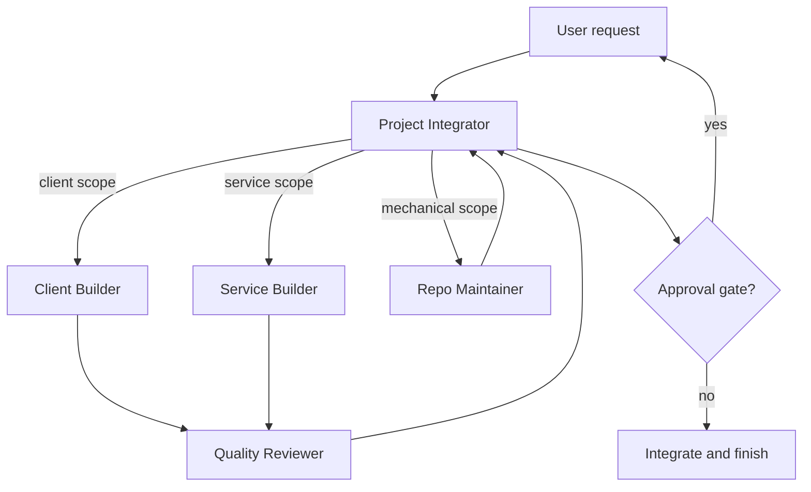

# CodeArchive Agent Architecture

## 1. Project assessment

CodeArchive spans a Chrome Extension, React dashboard, Spring API, FastAPI analysis service, PostgreSQL, Redis, external OAuth integrations, async work, and deployment. Its context is broad, but the repository is still in an initial scaffold state and section 23.0 prioritizes a tightly coupled local Extension prototype.

The design therefore uses a centralized hub-and-spoke topology with specialists invoked only when their paths and contracts are stable. It avoids one agent per technology because that would add coordination before independent work exists.

Key constraints:

- shared mutable state in one monorepo;
- `packages/shared-types`, root configuration, CI, and documentation affect multiple components;
- user code, OAuth tokens, AI transmission, and external uploads create security/privacy approval points;
- platform DOM adapters require regression fixtures and rapid maintenance;
- implementation and specification may drift and must not be silently reconciled;
- current `README.md` is empty and the repository contains placeholder packages;
- the specification says Spring Boot 3 while the current Gradle file declares Spring Boot 4.1.0.

## 2. Architecture decision

Use one strategic project integrator, two balanced implementation specialists, and one independent balanced reviewer. Keep a fast repo maintainer available only for explicit mechanical tasks.

The service builder temporarily owns both Spring and FastAPI because current service code is minimal and those workstreams are not yet simultaneously active. Split it into API/data and analysis agents only when stable service contracts exist and independent parallel work is actually queued.

## 3. Agent roster

| Agent | Purpose and non-goals | Capability tier / resolved model | Owned paths | Output and handoff |
|---|---|---|---|---|
| Project Integrator | Plans, routes, owns shared contracts, resolves drift, integrates; avoids routine implementation | Strategic / `gpt-5.6-sol` | `AGENTS.md`, root config, `packages/shared-types/**`, `.github/**`, `docs/**`, cross-component changes | Plan, decision record, accepted specialist handoffs, final integration |
| Client Builder | Extension and dashboard implementation; does not change server or shared contracts alone | Balanced / `gpt-5.6-terra` | `apps/extension/**`, `apps/web/**` | Working client slice, tests/build evidence, contract proposal |
| Service Builder | Spring, FastAPI, database, Redis, integrations, infra; does not change client/shared contracts alone | Balanced / `gpt-5.6-terra` | `apps/api/**`, `apps/analysis/**`, `infra/**` | Service slice, migration/API diffs, tests and recovery notes |
| Quality Reviewer | Independent correctness, contract, security, privacy, and operations review; normally read-only | Balanced / `gpt-5.6-terra` | Read all; no production ownership | Severity-ranked findings or approval with evidence |
| Repo Maintainer | Mechanical, reversible work only; no architectural or security judgment | Fast / `gpt-5.6-luna` | Explicitly assigned files only | Small diff and deterministic check output |

The concrete model binding reflects the current available Codex catalog. Capability tiers are the durable requirement; if model names change, re-resolve the model while preserving the tier.

## 4. Execution flow



Default sequence:

1. Integrator classifies the task, reads the relevant specification, and records acceptance criteria.
2. One specialist owns each mutable path. Client and service work may run in parallel only when their interface is frozen.
3. Shared-contract proposals return to the integrator before either side implements them.
4. Reviewer checks the integrated diff. Blocker/major findings return to the original owner for one correction round.
5. The integrator runs or verifies final checks and requests user approval at consequential gates.

## 5. Routing rules

- Use the integrator alone for small, tightly coupled, cross-boundary diagnosis or planning.
- Use the client builder for the current Phase 2 and Phase 3 flow.
- Use the service builder only for explicitly scheduled service/infra work until the local prototype is complete.
- Use the reviewer for changes involving contracts, security, persistence, external integrations, releases, or a substantial feature slice.
- Use the repo maintainer only when inputs, output paths, and checks are deterministic.
- Escalate to strategic tier for conflicting requirements, multi-component impact, security/privacy implications, destructive changes, two failed attempts, or unlocalized integration failures.

## 6. Operating rules

### Shared state

The integrator is the only role that accepts shared-contract changes. Agents must not edit the same file concurrently. Parallel branches must keep stable interfaces and disjoint paths.

### Handoff schema

```yaml
scope: "bounded goal"
changed_paths: []
contract_changes: []
checks_run: []
check_results: []
risks: []
follow_up: []
```

### Approval gates

Obtain explicit user approval immediately before merging `develop` into `master`, production deployment, public/external upload of user code, OAuth or browser permission expansion, destructive migration or deletion, secret rotation, or a cost-bearing external action beyond the agreed task. Release merge approval and provider deployment approval are separate gates; one never authorizes the other.

### Budgets and stopping

- Planning: one primary plan; compare alternatives only for material trade-offs.
- Implementation: at most two attempts per approach with new evidence required for the second.
- Review: one review and one re-review.
- Stop when acceptance criteria and relevant checks pass; do not keep dormant agents active.

## 7. Phase-specific activation

| Development phase | Active core |
|---|---|
| Phase 1 | Integrator + relevant builder + reviewer for contracts/CI |
| Phase 2–4 | Integrator + Client Builder + Reviewer |
| Phase 5–6 | Integrator + Client Builder + Service Builder + Reviewer |
| Phase 7–9 | Integrator + Service Builder + Reviewer; split analysis role only if parallel demand justifies it |
| Phase 10 / releases | Integrator + relevant builder + Reviewer; user approval at release gates |

## 8. Trade-offs and failure modes

This structure spends strategic-model cost on planning and integration, balanced-model cost on substantive implementation/review, and fast-model cost only on routine work. It favors consistency over maximum parallelism.

Main failure modes are integrator bottleneck, stale shared contracts, false parallelism, and specification drift. Countermeasures are explicit path ownership, contract-first handoffs, short review budgets, phase-specific activation, and recorded drift decisions.


## 9. ChatGPT Work execution

The Work surface uses the same role contracts as explicit Skills bundled in `plugins/codearchive-workflows`. Each chat selects one model and one Skill. GitHub issues and pull requests replace conversational handoffs; see `docs/work-skill-workflow.md`. Automatic Skill invocation is disabled for these roles so a chat cannot silently switch ownership.
