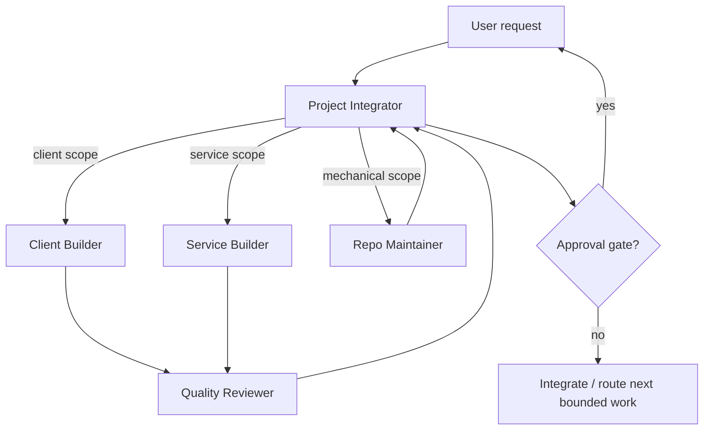

# CodeArchive Agent Architecture

## 1. Project assessment

CodeArchive spans a Chrome Extension, React Dashboard, Spring API, FastAPI analysis service, PostgreSQL, Redis, external OAuth integrations, async work, and deployment. The architecture uses a centralized hub-and-spoke topology with specialists invoked only when path ownership and contracts are stable.

Key constraints:

- shared mutable state in one monorepo;
- `packages/shared-types`, root configuration, CI, and documentation affect multiple components;
- user code, OAuth tokens, AI transmission, and external uploads create security/privacy/consent approval points;
- platform DOM adapters require regression fixtures and rapid maintenance;
- the Extension is a capture-only trust boundary: it must not own OAuth, backend credentials, direct Main API synchronization, AI, or external integrations;
- the Dashboard owns authenticated synchronization and may automatically drain local Extension captures only through the frozen exact-origin bridge contract;
- Extension → Dashboard synchronization is a shared client contract even though both implementations live under Client Builder ownership;
- `develop` is the integration and development/beta runtime source; `master` is the Production release/deployment source;
- implementation and specification may drift and must not be silently reconciled.

## 2. Architecture decision

Use one strategic Project Integrator, two balanced implementation specialists, and one independent balanced reviewer. Keep a fast Repo Maintainer available only for explicit mechanical tasks.

The Service Builder temporarily owns both Spring and FastAPI because those workstreams do not yet justify separate agents. Split it only when stable contracts and parallel demand exist.

## 3. Agent roster

| Agent | Purpose and non-goals | Capability tier / resolved model | Owned paths | Output and handoff |
|---|---|---|---|---|
| Project Integrator | Plans, routes, owns shared contracts/environment policy, resolves drift, integrates; avoids routine implementation | Strategic / `gpt-5.6-sol` | `AGENTS.md`, root config, `packages/shared-types/**`, `.github/**`, `docs/**`, cross-component changes | Plan, decision record, accepted specialist handoffs, environment/release decision |
| Client Builder | Extension capture/bridge and Dashboard auth/auto-sync implementation; does not change server or shared contracts alone | Balanced / `gpt-5.6-terra` | `apps/extension/**`, `apps/web/**` | Working client slice, tests/build evidence, contract proposal |
| Service Builder | Spring, FastAPI, database, Redis, integrations, infra; does not change client/shared contracts alone | Balanced / `gpt-5.6-terra` | `apps/api/**`, `apps/analysis/**`, `infra/**` | Service slice, migration/API diffs, tests and recovery notes |
| Quality Reviewer | Independent correctness, contract, security, privacy, consent, environment and operations review; normally read-only | Balanced / `gpt-5.6-terra` | Read all; no production ownership | Severity-ranked findings or approval with evidence |
| Repo Maintainer | Mechanical, reversible work only; no architectural or security judgment | Fast / `gpt-5.6-luna` | Explicitly assigned files only | Small diff and deterministic check output |

The concrete model binding reflects the current available catalog. Capability tiers are the durable requirement; if model names change, re-resolve the model while preserving the tier.

## 4. Execution flow



Default sequence:

1. Integrator classifies the task, reads the relevant specification/design contract, and records acceptance criteria, owned paths, and target environment.
2. One specialist owns each mutable path. Client and service work may run in parallel only when their interface is frozen.
3. Shared-contract proposals return to the Integrator before either side implements them.
4. Reviewer checks the integrated diff. Blocker/major findings return to the original owner for one correction round.
5. Integrator verifies final checks and requests user approval only at actual gates.
6. After `develop` integration, development/beta validation may proceed from the exact reviewed `develop` commit after its own deployment approval.
7. Production promotion remains `develop` → `master`, followed by a separate Production deployment approval.

## 5. Routing rules

- Use the Integrator alone for small, tightly coupled, cross-boundary diagnosis or planning.
- Use the Client Builder for Extension capture/bridge and Dashboard login/auto-sync work.
- Route Extension bridge and Dashboard sync as separate bounded slices even though the same role owns both paths.
- Freeze `docs/extension-dashboard-handoff-design.md` plus shared types before independent client/service implementation.
- Extension tasks must not add OAuth, CodeArchive token persistence, direct Main API synchronization, or account ownership logic.
- Dashboard tasks own authenticated auto-sync: connection lifecycle, user consent state, pending catch-up, API retry/upsert, partial ACK, and account-context transitions.
- Use Service Builder when the frozen bulk-upsert/idempotency contract requires API/database/infra implementation.
- Use Reviewer for changes involving browser bridge contracts, source-code transmission, authentication, security, persistence, external integrations, environment/deployment behavior, releases, or substantial feature slices.
- Use Repo Maintainer only when inputs, output paths, and checks are deterministic.
- Escalate to Strategic tier for conflicting requirements, multi-component impact, security/privacy/consent implications, schema/environment changes, destructive changes, two failed attempts, or unlocalized integration failures.

## 6. Operating rules

### Shared state

The Integrator is the only role that accepts shared-contract or environment-policy changes. Agents must not edit the same file concurrently. Parallel branches must keep stable interfaces and disjoint paths.

### Handoff schema

```yaml
scope: "bounded goal"
changed_paths: []
contract_changes: []
checks_run: []
check_results: []
security_privacy_consent: []
environment_impact: []
risks: []
follow_up: []
```

### Approval gates

Obtain explicit user approval immediately before:

- implementation PR merge into `develop`;
- development/beta external deployment/restart/redeploy;
- `develop` → `master` release merge;
- Production deployment;
- public/external upload of user code outside an already user-enabled product synchronization flow;
- OAuth/browser/origin permission expansion;
- destructive migration or deletion;
- secret rotation;
- cost-bearing external action beyond the agreed task.

These are separate gates. One never authorizes another.

### Environment contract

```text
feature/fix/chore
  → develop PR
  → develop
  → development/beta deployment and acceptance
  → develop → master release PR
  → master
  → Production deployment
```

- `develop`: integration plus development/beta runtime source.
- `master`: Production release/deployment source.
- Never deploy Production from `develop`.
- Do not use `master` for routine development/beta iteration.
- Keep provider auto-deploy disabled unless an explicit later decision changes it.
- Existing beta resources remain beta resources; creating/converting Production resources is a separate Integrator decision.

### Budgets and stopping

- Planning: one primary plan; compare alternatives only for material trade-offs.
- Implementation: at most two attempts per approach with new evidence required for the second.
- Review: one review and one re-review.
- Stop when acceptance criteria and relevant checks pass; do not keep dormant agents active.

## 7. Phase-specific activation

| Development phase | Active core |
|---|---|
| Capture/bridge contract | Integrator + Client Builder + Reviewer |
| Dashboard auth/auto-sync | Integrator + Client Builder + Reviewer |
| API bulk-upsert/idempotency | Integrator + Service Builder + Reviewer |
| Cross-client/server E2E | Integrator + Client Builder + Service Builder + Reviewer |
| Legacy cleanup | Integrator + bounded owning Builder + Reviewer |
| Development/beta deployment | Integrator + relevant Builder/Reviewer; explicit deployment approval |
| Production release | Integrator + relevant Builder + Reviewer; separate release-merge and Production-deployment approvals |

## 8. Trade-offs and failure modes

This structure spends strategic-model cost on planning/integration, balanced-model cost on substantive implementation/review, and fast-model cost only on routine work. It favors consistency over maximum parallelism.

Main failure modes are Integrator bottleneck, stale shared contracts, false parallelism, account-context leakage during auto-sync, premature legacy cleanup, and environment drift between beta and Production. Countermeasures are exact path ownership, contract-first handoffs, ephemeral bridge capabilities, replacement-before-removal, exact deployed commit recording, and separate environment gates.

## 9. ChatGPT Work execution

The Work surface uses the same role contracts as explicit Skills bundled in `plugins/codearchive-workflows`. Each chat selects one model and one Skill. GitHub issues and pull requests replace conversational handoffs; see `docs/work-skill-workflow.md`. Automatic Skill invocation is disabled for these roles so a chat cannot silently switch ownership.
